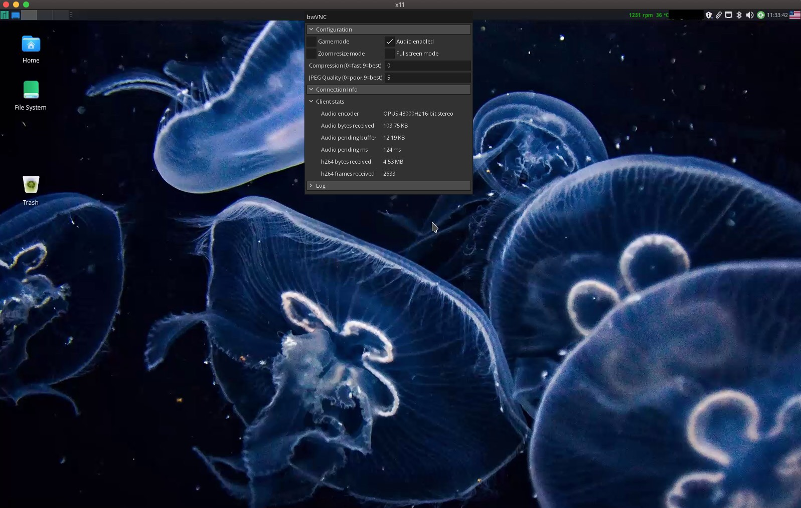

# Bells & Whistles VNC Client (bwVNC)

What is this?
=============

bwVNC is a VNC client suitable for remote gaming and streaming

Details & Features
==================

bwVNC is a cross-platform SDL2-based VNC client built on top of customised LibVNCServer's client library

#### Features:

- H.264 encoding support
- QEMU Audio support - RAW PCM and OPUS
- Relative mouse mode support for FPS gaming

To have all the features it has to be used in pair with [bwTurboVNC](https://github.com/faust93/turbovnc) server

Screenshots
===========



How to build
=============

Required dependencies:
- CMake
- SDL2
- FFmpeg
- Opus

On Arch based distros use the following command:
~~~shell
$ yay -S cmake sdl2 opus ffmpeg
$ git clone https://github.com/faust93/bwVNC.git
~~~

Inside bwVNC source folder:

```shell
$ mkdir build && cd build
$ cmake ..
$ cmake --build .
```

Usage
=====

~~~shell
$ ./bwvnc 
Usage: ./bwvnc [options] [vnc options] server:port
 Options:
  -showdrivers          Show available SDL rendering drivers
  -sdldriver [s]        Use [s] SDL render driver (default: opengl)
  -noaudio              Disable audio support (default: enabled)
  -audio-profile [n]    Specify audio profile to use: (default: 1)
                        0: PCM 11025Hz 16-bit stereo
                        1: PCM 22050Hz 16-bit stereo
                        2: PCM 44100Hz 16-bit stereo
                        3: OPUS 22050Hz 16-bit stereo
                        4: OPUS 32000Hz 16-bit stereo
                        5: OPUS 44100Hz 16-bit stereo
                        6: OPUS 48000Hz 16-bit stereo
  -resizable [s]        Enable desktop window resizing (default: on)
  -resize-method [s]    Resizing method to use: zoom, desktop (default: desktop)
                        'desktop' - change desktop resolution on the server side
                        'zoom'    - rescale desktop picture to the client window size
  -no-logs              Disable logging (default: on)
 VNC options:
  -encodings [s]         VNC encoding to use: h264 tight zrle ultra copyrect hextile zlib corre rre raw (default: h264)
  -compress [n]          Specify compression level: 0-fast, 9-best (default: 0)
                         For H264 encoder it means preconfigured encoding profile num, from 0 to 9
  -quality [n]           Specify JPEG quality level: 0-poor, 9-best (default: 5)
~~~

#### Connect to the server
~~~shell
$ bwvnc -audio-profile 6 -compress 1 192.168.1.2:5901
~~~

`-audio-profile` - specify which audio profile to use, see available profiles above

`-compress` - for H.264 encoding allows to specify h.264 encoder profile from 0 to 9 (profiles are configured on the server side)

By default **bwTurboVNC** has the following profiles configured:
- 0: Default Profile, HW VAAPI 800000 bit/s 30 fps Constant Quality
- 1: Mid Bandwidth Profile, HW VAAPI 800000 bit/s 25 fps СQP
- 2: Low Bandwidth Profile, HW VAAPI 500000 bit/s 23 fps СBR
- 3: x264 Default Profile, SW+OpenCL x264 800000 bit/s 30 fps Constant
- 4: Mid Bandwidth Profile, SW+OpenCL x264 800000 bit/s 25 fps Constant
- 5: Low Bandwidth Profile, SW+OpenCL x264 500000 bit/s 23 fps Constant

You can change default settings or configure your own profiles (up to 9) on the [server](https://github.com/faust93/turbovnc/blob/main/unix/Xvnc/programs/Xserver/hw/vnc/h264/ffh264.cfg) side

It's also possible to switch h.264 profiles on the fly, press `F12` while VNC session is open and specify profile number in `Compression` text field

#### Menu Options

Press `F12` while being in VNC session:
- Game mode - switches on relative mouse mode and restricted keyboard mode suitable for gaming
- Audio enabled - enable/disable audio output
- Zoom resize mode - while enabled just scales picture during window resizing, desktop resolution stays the same. While disabled - changes desktop resolution.
- Fullscreen mode - switch to fullscreen mode, respects 'Zoom resize mode' switch
- Compression - for Tight encoder changes compression rate, for h.264 selects encoding profile
- JPEG Quality - JPEG quality for Tight encoder

